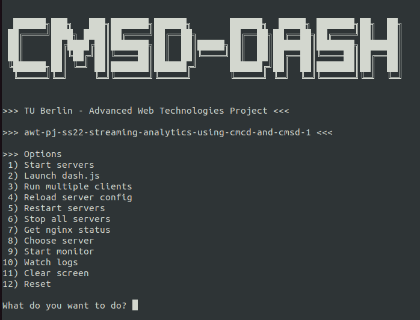
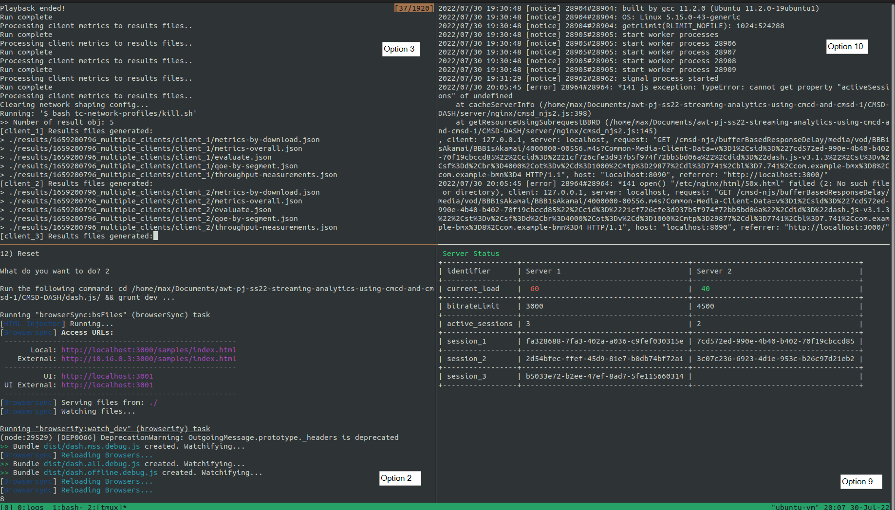

# Advanced Web Technologies Project @ TUB 

## Streaming analytics using CMCD and CMSD

Video streaming analytics enable content providers to analyze how video players behave and identify problems on certain platforms or devices.  

The Common-Media-Client-Data (CMCD) standard defines the format and the types of metrics send from a client to a metric server and database. A user interface build on top of the collected data helps evaluating and structuring the massive amount of information.  

Common-Media-Server-Data (CMSD) - not published yet - enables server-side (CDN/origin) communication to the clients. Early implementations are available for experimentation.

This project extends the prototype [CMSD-DASH of NUStreaming](https://github.com/NUStreaming/CMSD-DASH) and is described in detail in the paper *Streaming Analytics using CMCD and CMSD* which can be found in the `report` folder.
***

 

## Installation Requirements
To get started with this project, you must first install the following requirements. Please note that the installation commands are based on Ubuntu 22.04. If you are using a different operating system, you may need to adjust the installation procedure.

 

### Node.js
- `sudo apt install nodejs`
- `node -v`
- `sudo apt install npm`
- `npm -v`

 

### Grunt:
- `sudo npm install -g grunt`
- `grunt --version`

 

### Google Chrome
- Download Chrome:`wget https://dl.google.com/linux/direct/google-chrome-stable_current_amd64.deb`
- `sudo apt install ./google-chrome-table_current_amd64.deb`

 

### nginx
- **Install nginx**: `sudo apt install nginx`
- **Install NJS module**: `sudo apt install nginx-module-njs`
	- Possible error:  "E: Unable to locate package nginx-module-njs"
	- Follow those steps to get the newest nginx version: https://nginx.org/en/linux_packages.html#Ubuntu
	- Run `sudo apt install nginx-module-njs` again
- **Install echo module**, look into https://github.com/openresty/echo-nginx-module#installation or follow these steps:
	- Create directory for temporary nginx installation: `mkdir tmp_nginx` + `cd tmp_nginx`
	- Copy path for later (e.g. `pwd` ->  `/home/username/Documents/tmp_nginx`)
	- `cd ~/Downloads`
	- Download echo module: `wget 'https://github.com/openresty/echo-nginx-module/archive/refs/tags/v0.62.tar.gz'`
	- Unzip: `tar xf v0.62.tar.gz`
	- `cd echo-nginx-module-0.62/`
	- Copy path for later (e.g. `pwd` ->  `/home/username/Downloads/echo-nginx-module-0.62`)
	- `cd ..`
	- Check version of global nginx version: `nginx -v` (e.g. 1.22.0)
	- Download file for temporary nginx installation  (needs to be the same version as the current global nginx installation❗): `wget 'http://nginx.org/download/nginx-1.22.0.tar.gz'`
	- Unzip: `tar xf nginx-1.22.0.tar.gz`
	-  `cd nginx-1.22.0/`
	-  Install temporary nginx with downloaded module into temporary folder: `./configure --with-compat --prefix=/home/username/Documents/tmp_nginx --add-dynamic-module=/home/username/Downloads/echo-nginx-module-0.62` 
		- Possible PCRE library error -> `sudo apt install libpcre3 libpcre3-dev`, then run `./configure ...` command again
		- Possible zlib error -> `sudo apt install zlib1g-dev` and`sudo apt install zlib1g`, then run `./configure ...` command again
	- `make -j2`
	- `make install`
	- Copy the module from temporary installation into global nginx installation: `sudo cp /home/username/Documents/tmp_nginx/modules/ngx_http_echo_module.so /usr/lib/nginx/modules/`

 

### tc-NetEm
- https://wiki.linuxfoundation.org/networking/netem
- (already installed on ubuntu)

 

### FFmpeg 
- https://www.ffmpeg.org/download.html
- `sudo apt install ffmpeg`

 

### jq 
- https://stedolan.github.io/jq/
- `sudo apt install jq`

 

### Python
- `sudo apt install python3`
- (already installed on ubuntu)
- virtualenv: `pip install virtualenv`

***

 

## Setup and Testing
Before you can finally run this project, you need to perform a few setup steps, where some of them just have to be done only one time.

- Get the project: `git clone https://github.com/karmatothex/awt-pj-ss22-streaming-analytics-using-cmcd-and-cmsd-1.git`

 

### Setup the nginx server
- Open `server/nginx/config/nginx.conf` and edit `<PATH_TO_CMSD-DASH>` (under `location /media/vod`) to indicate the absolute path to this repository
	- Do this for both servers -> line 69 and line 179
- Test and launch nginx: `sudo nginx -c <PATH_TO_CMSD-DASH>/server/nginx/config/nginx.conf` (note that the absolute path must be used)
- Reload nginx: `sudo nginx -c <PATH_TO_CMSD-DASH>/server/nginx/config/nginx.conf -s reload`, if the configuration has changed

 

### Setup the dash.js client
- Navigate to the `dash.js/` folder (dash.js v3.1.3)
- Install the dependencies: `npm install`
- Build, watch file changes and launch samples page: `grunt dev`
- Test the `dash.js` application by navigating to `http://⟨MachineIP_ADDRESS⟩:3000/samples/cmsd-dash/index.html` to view the CMSD-enabled player (e.g. `http://localhost:3000/samples/cmsd-dash/index.html`)

 

### Setup the experiment
- Navigate to the `dash-test/` folder
- install the dependencies: `npm install`
-  There are two client profiles (with CMCD or NO CMCD):
	- `client_profile_join_test_with_cmcd.js`
	- `client_profile_join_test_no_cmcd.js`
- Update the setup parameters in the two client profile files based on the target scenario, such as the number of clients (`numClient`), minimum buffer (`minBufferGlobal`), maximum buffer (`maxBufferGlobal`), video location (`url`) and segment duration (`segmentDuration`). The set of video datasets are located in `cmcd-server/nginx/media/vod/`
- in the `batch_test.sh` edit the number of runs (line 16), the network profile (line 17) and the videocomment (line 18)
	-  Note that testing is done in Chrome headless mode by default. Headless mode can also be turned off in `dash-test/run-multiple-clients.js` (search for parameter `headless`)
	- The list of available network profiles are given in `dash-test/tc-network-profiles/`
	- If the batch test script is terminated prematurely, the background Chrome processes need to be killed which is included in the CLI option "12) Reset"

***

 

## Run the project with the command line interface (CLI)
During the course of this project and especially during testing, we had to use many different system commands to interact with the actual project. Therefore, we decided to develop a CLI to simplify the whole interaction with the system.

 

### Initial setup
- Install Python: `sudo apt install python3`
- Install virtualenv: `pip install virtualenv`
- Navigate to `/awt-pj-ss22-streaming-analytics-using-cmcd-and-cmsd-1/CMSD-DASH/cli/`
- Create virtual environment `venv`: `python3 -m venv venv`
- Activate virtual environment: `source venv/bin/activate`
	- Always do this in your specific terminal window if you want to use the CLI❗
- Install required Python libraries: `python -m pip install -r requirements.txt`

 

### Usage
- Navigate to `/awt-pj-ss22-streaming-analytics-using-cmcd-and-cmsd-1/CMSD-DASH/cli/`
- Activate virtual environment: `source venv/bin/activate`
- run the CLI: `python3 cli.py`, this should look like this:
	
	

 

Currently there are 12 Options:
1. Will start both nginx server instances on port 8080 and 8090
2. Will launch the dash.js client, which will open Chrome. After that you can go to http://localhost:3000/samples/cmsd-dash/index.html which will open the CMSD aware dash.js client
3. This option will run the `batch_test.sh` script.
4. In case you updated the `nginx.conf` file, you can reload the server instances with this option
5. Will restart nginx (e.g. used for troubleshooting).
6. Will stop nginx (e.g. used for troubleshooting).
7. Prints the nginx status.
8. This option lets you choose between the available servers and further interact with them (e.g. view and manipulate the server load) 
9. This option will open an overview in which information such as the number and connections and load of the individual servers are displayed. The view updates itself regularly.
10. Will open a new menu where you can choose between different log files (nginx access.log, nginx error.log, server 1 log, server 2 log). After a file is selected, the file is dynamically displayed using the `tail` command.
11. Will simply clear the screen.
12. This option is intended as a hard reset and terminates the entire project. After that the server (option 1) and the client(s) (option 2 and 3) must be restarted.

 

### Run the project
- To run the project just go for option 1 and 2. After that you can watch the client behavior in Chrome and add new clients by open new http://localhost:3000/samples/cmsd-dash/index.html tabs. 
- Instead of adding new clients via Chrome tabs you could also adjust the `batch_test.sh`, `client_profile_join_test_with_cmcd.js` and the `client_profile_join_test_no_cmcd.js` file as desired and go for option 3 (after using option 1 and 2). 
- By running option 3 and on completing the test run, results are generated in the `results/<timestamp>_multiple_clients/` folder ordered by the test run’s timestamp. 
- To generate summary results across all clients in a test run, first navigate to the `results/` folder and then run `python3 generate_summary.py`
	- After that you are prompted for the folder name that was generated, insert the name and press enter
- **Note**: To take advantage of the CLI one could open multiple instances of the CLI, for example in multiple tabs or panes (tmux)
- e.g.

	